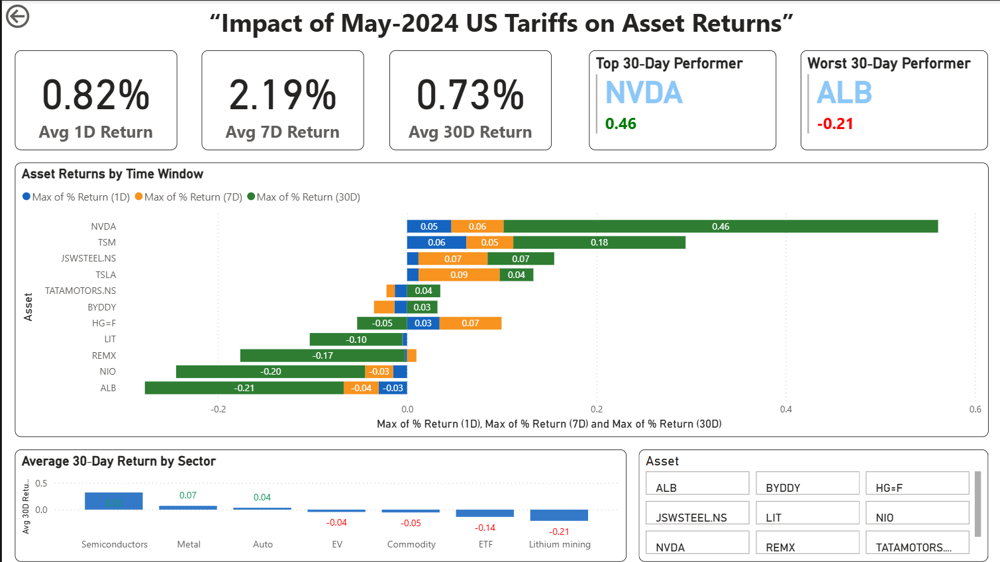
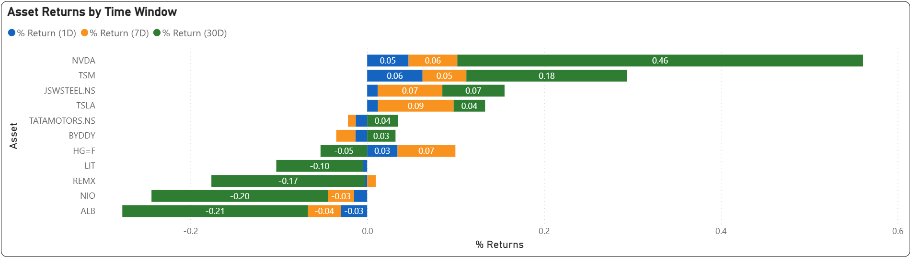
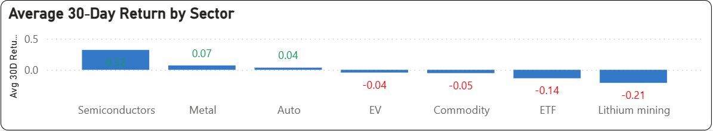

# 📊 Impact of May-2024 US Tariffs on Asset Returns

This project explores how the **May 2024 U.S. tariff hikes on Chinese imports** affected global equity and commodity markets — particularly companies operating in EVs, semiconductors, and critical minerals. By analyzing asset performance across multiple timeframes and sectors, the project demonstrates how macroeconomic trade policy decisions ripple through financial markets.

---

## 🧭 Objective

To analyze the short- and medium-term impact of U.S. tariff hikes on relevant equities and commodities using price and return data, and visualize the reaction using an interactive Power BI dashboard.

---

## 📅 Timeline

- **Tariff Announcement**: May 14, 2024  
- **Return Windows Analyzed**:  
  - 1 Day (May 15)  
  - 7 Days (May 21)  
  - 30 Days (June 14)

---

## 📂 Data Sources

- Yahoo Finance API (`yFinance`)
- USTR Tariff Press Release (May 2024)
- Manually extracted effective dates and impacted sectors

---

## 🧩 Methodology

- Assets selected from EV, semiconductor, lithium mining, and metals sectors
- Daily closing prices collected via `yfinance` Python script
- Returns computed over 1D, 7D, and 30D post-announcement
- Analysis and dashboard built in Excel and **Power BI**
- Bookmark-based toggle added for interactive navigation

---

## 📈 Dashboard Preview

> 🔗 **[Click here to view the interactive Power BI dashboard](https://app.powerbi.com/reportEmbed?reportId=b0a7ddd1-d477-46eb-9adf-886bdb8ce820&autoAuth=true&ctid=5131329f-62f1-4d08-8378-7971f6487fc7)**  
*(hosted on Power BI service)*

---

## 🧠 Key Insights

- 📈 **Semiconductors** (Nvidia, TSMC) had the strongest performance → +32% avg 30D return
- 🔻 **Lithium miners & ETFs** underperformed heavily → Albemarle (−21%)
- 🇺🇸 **U.S. firms** gained or remained neutral, benefiting from policy tailwinds
- 🇨🇳 **Chinese EVs** (BYD, NIO) faced muted or negative responses
- 📉 ETFs like LIT and REMX declined due to uncertainty in critical minerals

---

## 📊 Visual Highlights

### Asset Returns by Time Window  
*(1D, 7D, 30D return comparison for each asset)*  

### Sector-wise Average 30-Day Return  
*(Grouped by asset category: EV, semiconductor, mining, etc.)*  

---

## 🔮 Future Impacts

> The full consequences of these tariffs are likely to unfold over the coming months and years.

- Supply chains may realign toward domestic or neutral sourcing
- Lithium and rare-earth-dependent sectors may see cost inflation
- Global trade tensions could re-escalate if retaliatory measures arise
- Domestic semiconductor manufacturing and policy incentives are likely to grow

---

## 📊 Technologies Used

- Python (`yfinance`)
- Microsoft Excel
- Power BI Desktop
- GitHub for documentation

---

## 🧠 Learnings

This project demonstrates how:
- Financial market movements are deeply tied to macroeconomic and policy events
- Public data can be used to build end-to-end analysis pipelines
- Power BI can be leveraged for live dashboards using real-time data

---

## 📌 Author

**Harsh Garg**  
Aspiring Financial Analyst & Data Storyteller  
📫 [LinkedIn](https://linkedin.com/in/harsh-garg-54216820b)

---

## ⭐️ If you found this project useful, star the repo and share it with others!
